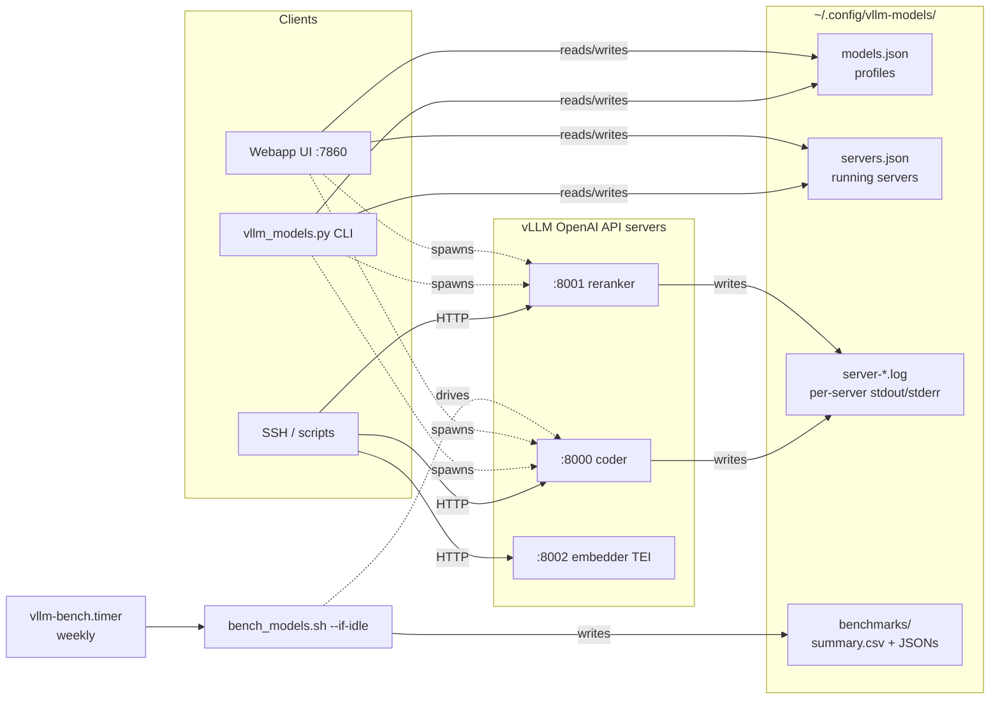
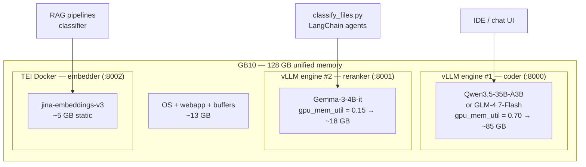
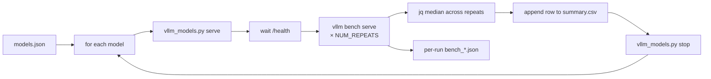
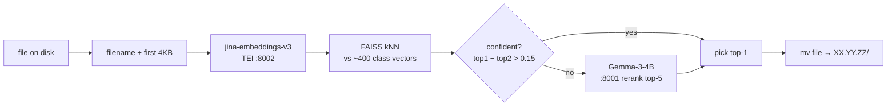

# vllm-tools

Local model-serving toolkit for an NVIDIA DGX Spark (GB10, 128 GB unified memory).
Manages Hugging Face model profiles, runs multiple concurrent vLLM servers,
benchmarks them on a schedule, and (in progress) classifies local files into a
hierarchical taxonomy.

## Components

| Component | Path | Purpose |
|---|---|---|
| **CLI** | `vllm_models.py` | Profile management, model download, multi-server lifecycle |
| **Webapp** | `webapp/` (FastAPI + Alpine) | UI on `:7860`; same multi-server backend as the CLI |
| **Benchmark** | `bench_models.sh` | `vllm bench serve` across every profile, CSV + per-run JSONs |
| **Scheduler** | `~/.config/systemd/user/vllm-bench.{service,timer}` | Weekly benchmark, skipped if any vLLM server is active |
| **Design doc** | `classification-architecture.md` | Architecture notes for the file-classification workstream |

Both frontends share on-disk state in `~/.config/vllm-models/` — no shared
Python module between them (per project convention).

## High-level architecture



## Quick start

```bash
# First-time setup (creates .venv, installs vllm + huggingface_hub[cli])
/home/igogo/vllm-tools/install_vllm_deps.sh

# Profile management
./vllm_models.py list
./vllm_models.py add <name> <hf-repo> --dtype bfloat16 --max-model-len 8192 \
    --tensor-parallel-size 1 --gpu-memory-utilization 0.9
./vllm_models.py pull <name>
./vllm_models.py remove <name>

# Serving (multi-server allowed)
./vllm_models.py serve <name> --port 8000
./vllm_models.py serve <name> --port 8001 --gpu-memory-utilization 0.15  # override for co-hosting
./vllm_models.py status                 # lists all running servers (tracked + external)
./vllm_models.py stop                   # stop everything + reap orphan EngineCore workers
./vllm_models.py stop <server-id>       # stop one by server-id
./vllm_models.py stop <model-name>      # stop by model name
./vllm_models.py restart <name> --port 8000

# Webapp
cd /home/igogo/vllm-tools && ./.venv/bin/python run_webapp.py
# then http://<spark-ip>:7860/
```

## Multi-server co-hosting

Unified-memory GB10 fits three engines comfortably if budgets are set carefully.
`gpu_memory_utilization` is a **fraction of total device memory** and should be
set per engine so the sum stays ≤ 0.85 (leaving 13+ GB for OS, webapp, and buffers).

Recommended layout for the coder + reranker + embedder setup:



Start them:

```bash
# Coder
./vllm_models.py serve glm47-flash --port 8000 --gpu-memory-utilization 0.70

# Reranker
./vllm_models.py serve gemma3-4b --port 8001 --gpu-memory-utilization 0.15

# Embedder via TEI (not vLLM — TEI is 2-3× more efficient for embeddings)
docker run -d --name tei-jina --gpus all -p 8002:80 \
  -v ~/.cache/huggingface:/data \
  ghcr.io/huggingface/text-embeddings-inference:1.5 \
  --model-id jinaai/jina-embeddings-v3 --dtype float16
```

All three expose OpenAI-compatible HTTP APIs (`/v1/completions`,
`/v1/chat/completions`, `/v1/embeddings`). They bind to `0.0.0.0` so any LAN /
Tailscale client can use them with an OpenAI SDK, LiteLLM, LangChain, etc.
**No auth by default** — acceptable inside LAN, put a reverse proxy with
auth in front before exposing publicly.

## Benchmarking

```bash
# One-off
./bench_models.sh

# Subset
ONLY=glm47-flash,qwen35-coder-35b ./bench_models.sh

# Custom workload
NUM_PROMPTS=50 INPUT_LEN=1024 OUTPUT_LEN=512 REQUEST_RATE=4 ./bench_models.sh

# Skip if any vLLM server is active (used by the timer)
./bench_models.sh --if-idle
```

Pipeline per model: `serve` → wait `/health` → `vllm bench serve` × `NUM_REPEATS=3`
with `--num-warmups=5` → median via `jq` → append one row to
`~/.config/vllm-models/benchmarks/summary.csv` → `stop`.



Scheduled weekly run: `systemctl --user list-timers vllm-bench.timer`.

## File classification (in progress)

Target: sort a local archive of personal files (~400-class hierarchical taxonomy
from `jd.yaml` on user's Mac, EN/UK/RU content) into `XX.YY.ZZ/` folders.
Full design: [`classification-architecture.md`](./classification-architecture.md).



Expected throughput on GB10: 300–800 files/sec average (embedding handles
~70% outright, reranker fires on the rest).

## State files

```
~/.config/vllm-models/
├── models.json             # profiles (one per model name)
├── servers.json            # running servers (shared CLI + webapp)
├── server-<ts>.log         # per-server stdout/stderr
├── server.pid + server.log # LEGACY single-slot (auto-migrated into servers.json)
└── benchmarks/
    ├── summary.csv         # one row per model per sweep (median aggregation)
    └── bench_*.json        # raw per-run bench JSONs (BENCH_KEEP=20)

~/.cache/huggingface/hub/
└── models--<org>--<name>/  # HF weight cache; *.incomplete means partial download
```

## Hardware notes (GB10 aarch64)

- Unified memory, not discrete VRAM. `nvidia-smi` shows `Memory-Usage: Not Supported`.
- Visible total ≈ 121 GB; keep combined `gpu_memory_utilization` ≤ 0.85.
- Any Python loading `torch`/`vllm` needs CUDA libs on `LD_LIBRARY_PATH`:
  ```
  /usr/lib/aarch64-linux-gnu/libcusparseLt/13
  /usr/lib/aarch64-linux-gnu/nvshmem/13
  /usr/local/cuda-13.0/targets/sbsa-linux/lib
  /usr/lib/aarch64-linux-gnu
  ```
  Both the CLI (`serve`) and the webapp (`core.start_server`) inject this into
  the vLLM subprocess env.
- Wheels must be the `cu130` aarch64 builds — set up by `install_vllm_deps.sh`.

## Notes

- **No test suite, lint config, or build step.** Don't invent one.
- The webapp UI is intentionally CDN-based (Tailwind, Alpine, Chart.js, marked) —
  no `package.json`. Keep it that way unless explicitly asked.
- The CLI and webapp **both** enforce: no same-model started twice, no port reuse,
  and (webapp only) enough free memory for model weights × 1.1.
- For embeddings, prefer TEI over vLLM (2–3× more efficient). vLLM's embedding
  support exists but is not its optimised path.
